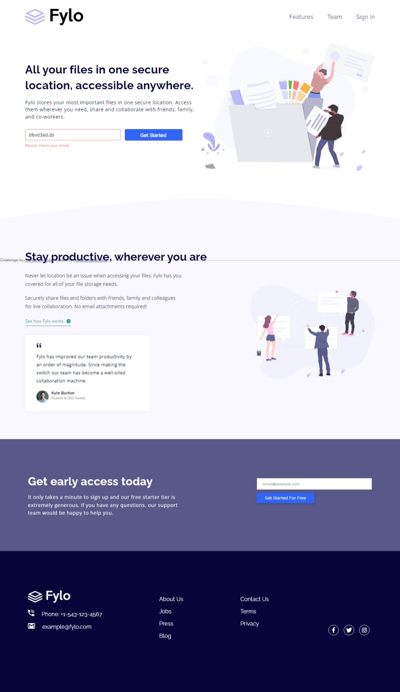
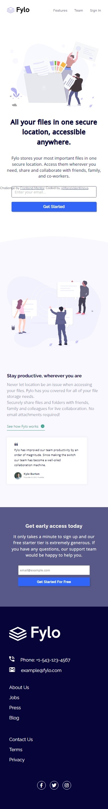

# Frontend Mentor - Fylo landing page with two column layout solution

This is a solution to the [Fylo landing page with two column layout challenge on Frontend Mentor](https://www.frontendmentor.io/challenges/fylo-landing-page-with-two-column-layout-5ca5ef041e82137ec91a50f5). Frontend Mentor challenges help you improve your coding skills by building realistic projects. 

## Table of contents

- [Overview](#overview)
  - [The challenge](#the-challenge)
  - [Screenshot](#screenshot)
  - [Links](#links)
- [My process](#my-process)
  - [Built with](#built-with)
  - [What I learned](#what-i-learned)
  - [Continued development](#continued-development)
  - [Useful resources](#useful-resources)
- [Author](#author)
- [Acknowledgments](#acknowledgments)

## Overview

### The challenge

Users should be able to:

- View the optimal layout for the interface depending on their device's screen size
- See hover and focus states for all interactive elements on the page

### Screenshot

### Links

- Solution URL: (https://github.com/MariaValentinova/Fylo-landing-page-with-two-column-layout)
- Live Site URL: [Add live site URL here](https://your-live-site-url.com)

## My process

### Built with

- Semantic HTML5 markup
- CSS custom properties
- Flexbox
- CSS Grid
- Mobile-first workflow
- JavaScript

### What I learned

Throughout this project, I expanded my knowledge in HTML and CSS, delving deeper into responsive design principles. Additionally, I gained proficiency in handling JavaScript events dynamically based on the screen size. This experience allowed me to enhance my skill set and effectively adapt user interfaces to varying device dimensions.

### Continued Development

I aim to enhance my skills across various aspects, including CSS and JavaScript, within this project. Continuous improvement remains a priority to refine the overall design and functionality.

### Useful resources

- - [Philip Droubi](https://www.frontendmentor.io/profile/Philip-Droubi): I utilized the footer logo from this profile as it was missing from the provided assets.

## Author 

- Frontend Mentor - [@MariaValentinova](https://www.frontendmentor.io/profile/MariaValentinova)

## Acknowledgments

I am deeply grateful to the following individuals whose expertise and guidance have been invaluable in the development of this project:

- [Philip Droubi](https://www.frontendmentor.io/profile/Philip-Droubi): His exceptional work served as a constant reference and inspiration throughout this project. His meticulous attention to detail and innovative approaches profoundly influenced my work.

- [Jordan Alexander](https://www.udemy.com/user/jordan-alexander-16/): Jordan's Udemy courses have been an incredible resource, significantly enhancing my knowledge and skills. His teachings provided invaluable insights that greatly contributed to the success of this project.

- [Juan Pablo de la Torre Valdez](https://www.udemy.com/user/juanpablodelatorrevaldez/): His JavaScript courses were particularly helpful and played a crucial role in the implementation of the JavaScript components in this project. Juan Pablo's classes were instrumental in advancing my proficiency in JavaScript.

Their expertise and commitment have immensely impacted my learning journey and have been pivotal in the completion of this project.
